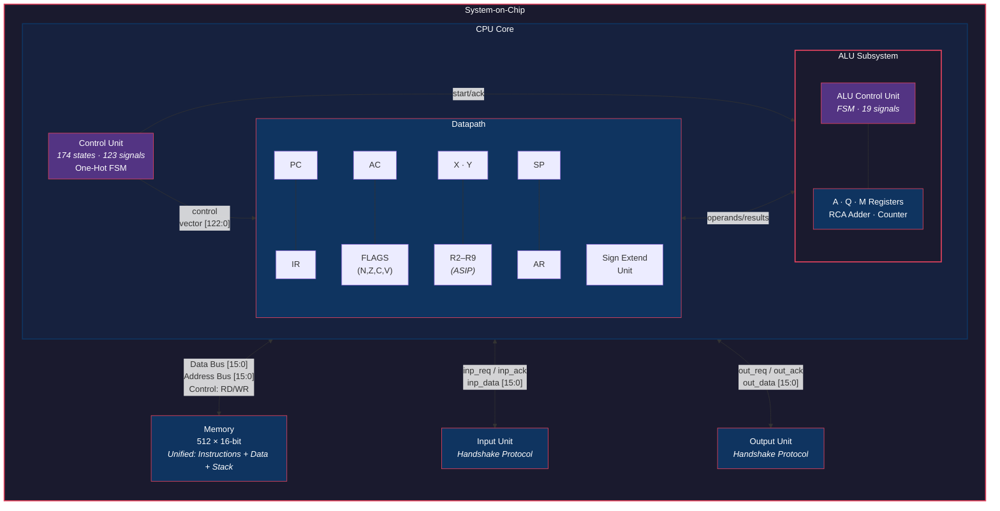
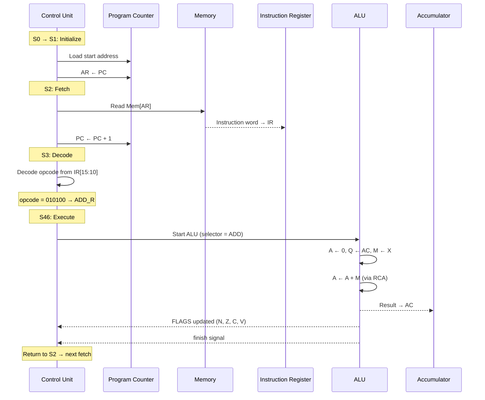

<div align="center">

# ASIP16-Processor

**A 16-bit general-purpose processor with tensor acceleration, built from the ground up in structural Verilog.**


</div>

---

## Overview

ASIP16 is a fully functional 16-bit processor implemented entirely in structural Verilog — no behavioral shortcuts, no `always @(*)` case statements for control logic. Every control signal is derived from Boolean equations and gate-level instantiations.

The processor executes real programs loaded from memory, supports a complete instruction set with arithmetic, logic, branching, stack operations, and I/O — and then goes further. An **Application-Specific Instruction Processor (ASIP)** extension adds hardware-accelerated tensor operations: addition, subtraction, element-wise multiplication, and full **matrix multiplication** — all as single instructions that operate directly on memory-resident data structures.

The CPU Control Unit alone implements **174 one-hot FSM states** generating **123 control signals**, all built structurally with flip-flops and combinational logic. The ALU operates as a self-contained subsystem with its own dedicated FSM-based Control Unit handling multi-cycle operations like multiplication and division. The entire system is integrated into a System-on-Chip that coordinates the CPU, 512-word unified memory, and handshake-based I/O units under a single clock domain.

This isn't a textbook exercise — it's a working computer that can multiply matrices.

---

## Architecture

The processor follows a classical **accumulator-based architecture** inspired by the IAS machine, with a centralized control strategy and a unified memory space for both instructions and data.

![Uploading cpu<svg xmlns="http://www.w3.org/2000/svg" width="800" height="400" viewBox="0 0 200 100">
  <defs>
    <radialGradient id="cpu-blue-grad" fx="1">
      <stop offset="0%" stop-color="#00E8ED"/>
      <stop offset="50%" stop-color="#0088FF"/>
      <stop offset="100%" stop-color="transparent"/>
    </radialGradient>
    <radialGradient id="cpu-yellow-grad" fx="1">
      <stop offset="0%" stop-color="#FFD800"/>
      <stop offset="50%" stop-color="#FFD800"/>
      <stop offset="100%" stop-color="transparent"/>
    </radialGradient>
    <radialGradient id="cpu-pinkish-grad" fx="1">
      <stop offset="0%" stop-color="#830CD1"/>
      <stop offset="50%" stop-color="#FF008B"/>
      <stop offset="100%" stop-color="transparent"/>
    </radialGradient>
    <radialGradient id="cpu-white-grad" fx="1">
      <stop offset="0%" stop-color="white"/>
      <stop offset="100%" stop-color="transparent"/>
    </radialGradient>
    <radialGradient id="cpu-green-grad" fx="1">
      <stop offset="0%" stop-color="#22c55e"/>
      <stop offset="100%" stop-color="transparent"/>
    </radialGradient>
    <radialGradient id="cpu-orange-grad" fx="1">
      <stop offset="0%" stop-color="#f97316"/>
      <stop offset="100%" stop-color="transparent"/>
    </radialGradient>
    <radialGradient id="cpu-cyan-grad" fx="1">
      <stop offset="0%" stop-color="#06b6d4"/>
      <stop offset="100%" stop-color="transparent"/>
    </radialGradient>
    <radialGradient id="cpu-rose-grad" fx="1">
      <stop offset="0%" stop-color="#f43f5e"/>
      <stop offset="100%" stop-color="transparent"/>
    </radialGradient>

    <filter id="cpu-light-shadow" x="-50%" y="-50%" width="200%" height="200%">
      <feDropShadow dx="1.5" dy="1.5" stdDeviation="1" flood-color="black" flood-opacity="0.1"/>
    </filter>

    <marker id="cpu-circle-marker" viewBox="0 0 10 10" refX="5" refY="5" markerWidth="18" markerHeight="18">
      <circle cx="5" cy="5" r="2" fill="black" stroke="#232323" stroke-width="0.5">
        <animate attributeName="r" values="0; 3; 2" dur="0.5s"/>
      </circle>
    </marker>

    <linearGradient id="cpu-connection-gradient" x1="0" y1="0" x2="0" y2="1">
      <stop offset="0%" stop-color="#4F4F4F"/>
      <stop offset="60%" stop-color="#121214"/>
    </linearGradient>

    <linearGradient id="cpu-text-gradient" x1="0" y1="0" x2="1" y2="0">
      <stop offset="0%" stop-color="#666666">
        <animate attributeName="offset" values="-2; -1; 0" dur="5s" repeatCount="indefinite"
          calcMode="spline" keyTimes="0; 0.5; 1" keySplines="0.4 0 0.2 1; 0.4 0 0.2 1"/>
      </stop>
      <stop offset="25%" stop-color="white">
        <animate attributeName="offset" values="-1; 0; 1" dur="5s" repeatCount="indefinite"
          calcMode="spline" keyTimes="0; 0.5; 1" keySplines="0.4 0 0.2 1; 0.4 0 0.2 1"/>
      </stop>
      <stop offset="50%" stop-color="#666666">
        <animate attributeName="offset" values="0; 1; 2" dur="5s" repeatCount="indefinite"
          calcMode="spline" keyTimes="0; 0.5; 1" keySplines="0.4 0 0.2 1; 0.4 0 0.2 1"/>
      </stop>
    </linearGradient>

    <mask id="cpu-mask-1">
      <path d="M 10 20 h 79.5 q 5 0 5 5 v 24" stroke-width="1" stroke="white" fill="none"/>
    </mask>
    <mask id="cpu-mask-2">
      <path d="M 180 10 h -69.7 q -5 0 -5 5 v 24" stroke-width="1" stroke="white" fill="none"/>
    </mask>
    <mask id="cpu-mask-3">
      <path d="M 130 20 v 21.8 q 0 5 -5 5 h -10" stroke-width="1" stroke="white" fill="none"/>
    </mask>
    <mask id="cpu-mask-4">
      <path d="M 170 80 v -21.8 q 0 -5 -5 -5 h -50" stroke-width="1" stroke="white" fill="none"/>
    </mask>
    <mask id="cpu-mask-5">
      <path d="M 135 65 h 15 q 5 0 5 5 v 10 q 0 5 -5 5 h -39.8 q -5 0 -5 -5 v -20" stroke-width="1" stroke="white" fill="none"/>
    </mask>
    <mask id="cpu-mask-6">
      <path d="M 94.8 95 v -36" stroke-width="1" stroke="white" fill="none"/>
    </mask>
    <mask id="cpu-mask-7">
      <path d="M 88 88 v -15 q 0 -5 -5 -5 h -10 q -5 0 -5 -5 v -5 q 0 -5 5 -5 h 14" stroke-width="1" stroke="white" fill="none"/>
    </mask>
    <mask id="cpu-mask-8">
      <path d="M 30 30 h 25 q 5 0 5 5 v 6.5 q 0 5 5 5 h 20" stroke-width="1" stroke="white" fill="none"/>
    </mask>
  </defs>

  <!-- Background -->
  <rect width="200" height="100" fill="#0d0d0d" rx="4"/>

  <!-- Paths with draw animation -->
  <g stroke="#2a2a2a" fill="none" stroke-width="0.3" marker-start="url(#cpu-circle-marker)">
    <path d="M 10 20 h 79.5 q 5 0 5 5 v 30" stroke-dasharray="100 100" pathLength="100">
      <animate attributeName="stroke-dashoffset" from="100" to="0" dur="1s" fill="freeze"
        calcMode="spline" keySplines="0.25,0.1,0.5,1" keyTimes="0; 1"/>
    </path>
    <path d="M 180 10 h -69.7 q -5 0 -5 5 v 30" stroke-dasharray="100 100" pathLength="100">
      <animate attributeName="stroke-dashoffset" from="100" to="0" dur="1s" fill="freeze"
        calcMode="spline" keySplines="0.25,0.1,0.5,1" keyTimes="0; 1"/>
    </path>
    <path d="M 130 20 v 21.8 q 0 5 -5 5 h -10" stroke-dasharray="100 100" pathLength="100">
      <animate attributeName="stroke-dashoffset" from="100" to="0" dur="1s" fill="freeze"
        calcMode="spline" keySplines="0.25,0.1,0.5,1" keyTimes="0; 1"/>
    </path>
    <path d="M 170 80 v -21.8 q 0 -5 -5 -5 h -50" stroke-dasharray="100 100" pathLength="100">
      <animate attributeName="stroke-dashoffset" from="100" to="0" dur="1s" fill="freeze"
        calcMode="spline" keySplines="0.25,0.1,0.5,1" keyTimes="0; 1"/>
    </path>
    <path d="M 135 65 h 15 q 5 0 5 5 v 10 q 0 5 -5 5 h -39.8 q -5 0 -5 -5 v -20" stroke-dasharray="100 100" pathLength="100">
      <animate attributeName="stroke-dashoffset" from="100" to="0" dur="1s" fill="freeze"
        calcMode="spline" keySplines="0.25,0.1,0.5,1" keyTimes="0; 1"/>
    </path>
    <path d="M 94.8 95 v -36" stroke-dasharray="100 100" pathLength="100">
      <animate attributeName="stroke-dashoffset" from="100" to="0" dur="1s" fill="freeze"
        calcMode="spline" keySplines="0.25,0.1,0.5,1" keyTimes="0; 1"/>
    </path>
    <path d="M 88 88 v -15 q 0 -5 -5 -5 h -10 q -5 0 -5 -5 v -5 q 0 -5 5 -5 h 14" stroke-dasharray="100 100" pathLength="100">
      <animate attributeName="stroke-dashoffset" from="100" to="0" dur="1s" fill="freeze"
        calcMode="spline" keySplines="0.25,0.1,0.5,1" keyTimes="0; 1"/>
    </path>
    <path d="M 30 30 h 25 q 5 0 5 5 v 6.5 q 0 5 5 5 h 20" stroke-dasharray="100 100" pathLength="100">
      <animate attributeName="stroke-dashoffset" from="100" to="0" dur="1s" fill="freeze"
        calcMode="spline" keySplines="0.25,0.1,0.5,1" keyTimes="0; 1"/>
    </path>
  </g>

  <!-- Orb 1 - Blue -->
  <g mask="url(#cpu-mask-1)">
    <circle r="8" fill="url(#cpu-blue-grad)">
      <animateMotion dur="3s" repeatCount="indefinite" begin="0s"
        path="M 10 20 h 79.5 q 5 0 5 5 v 24"/>
      <animate attributeName="opacity" values="0;1;1;0" keyTimes="0;0.05;0.9;1" dur="3s" repeatCount="indefinite" begin="0s"/>
    </circle>
  </g>

  <!-- Orb 2 - Yellow -->
  <g mask="url(#cpu-mask-2)">
    <circle r="8" fill="url(#cpu-yellow-grad)">
      <animateMotion dur="3s" repeatCount="indefinite" begin="0.4s"
        path="M 180 10 h -69.7 q -5 0 -5 5 v 24"/>
      <animate attributeName="opacity" values="0;1;1;0" keyTimes="0;0.05;0.9;1" dur="3s" repeatCount="indefinite" begin="0.4s"/>
    </circle>
  </g>

  <!-- Orb 3 - Pinkish -->
  <g mask="url(#cpu-mask-3)">
    <circle r="8" fill="url(#cpu-pinkish-grad)">
      <animateMotion dur="2.5s" repeatCount="indefinite" begin="0.8s"
        path="M 130 20 v 21.8 q 0 5 -5 5 h -10"/>
      <animate attributeName="opacity" values="0;1;1;0" keyTimes="0;0.05;0.9;1" dur="2.5s" repeatCount="indefinite" begin="0.8s"/>
    </circle>
  </g>

  <!-- Orb 4 - White -->
  <g mask="url(#cpu-mask-4)">
    <circle r="8" fill="url(#cpu-white-grad)">
      <animateMotion dur="2.8s" repeatCount="indefinite" begin="1.2s"
        path="M 170 80 v -21.8 q 0 -5 -5 -5 h -50"/>
      <animate attributeName="opacity" values="0;1;1;0" keyTimes="0;0.05;0.9;1" dur="2.8s" repeatCount="indefinite" begin="1.2s"/>
    </circle>
  </g>

  <!-- Orb 5 - Green -->
  <g mask="url(#cpu-mask-5)">
    <circle r="8" fill="url(#cpu-green-grad)">
      <animateMotion dur="3.5s" repeatCount="indefinite" begin="1.6s"
        path="M 135 65 h 15 q 5 0 5 5 v 10 q 0 5 -5 5 h -39.8 q -5 0 -5 -5 v -20"/>
      <animate attributeName="opacity" values="0;1;1;0" keyTimes="0;0.05;0.9;1" dur="3.5s" repeatCount="indefinite" begin="1.6s"/>
    </circle>
  </g>

  <!-- Orb 6 - Orange -->
  <g mask="url(#cpu-mask-6)">
    <circle r="8" fill="url(#cpu-orange-grad)">
      <animateMotion dur="2s" repeatCount="indefinite" begin="2.0s"
        path="M 94.8 95 v -36"/>
      <animate attributeName="opacity" values="0;1;1;0" keyTimes="0;0.05;0.9;1" dur="2s" repeatCount="indefinite" begin="2.0s"/>
    </circle>
  </g>

  <!-- Orb 7 - Cyan -->
  <g mask="url(#cpu-mask-7)">
    <circle r="8" fill="url(#cpu-cyan-grad)">
      <animateMotion dur="3.2s" repeatCount="indefinite" begin="2.4s"
        path="M 88 88 v -15 q 0 -5 -5 -5 h -10 q -5 0 -5 -5 v -5 q 0 -5 5 -5 h 14"/>
      <animate attributeName="opacity" values="0;1;1;0" keyTimes="0;0.05;0.9;1" dur="3.2s" repeatCount="indefinite" begin="2.4s"/>
    </circle>
  </g>

  <!-- Orb 8 - Rose -->
  <g mask="url(#cpu-mask-8)">
    <circle r="8" fill="url(#cpu-rose-grad)">
      <animateMotion dur="2.6s" repeatCount="indefinite" begin="0.2s"
        path="M 30 30 h 25 q 5 0 5 5 v 6.5 q 0 5 5 5 h 20"/>
      <animate attributeName="opacity" values="0;1;1;0" keyTimes="0;0.05;0.9;1" dur="2.6s" repeatCount="indefinite" begin="0.2s"/>
    </circle>
  </g>

  <!-- CPU connections -->
  <g fill="url(#cpu-connection-gradient)">
    <rect x="93" y="37" width="2.5" height="5" rx="0.7"/>
    <rect x="104" y="37" width="2.5" height="5" rx="0.7"/>
    <rect x="116.3" y="44" width="2.5" height="5" rx="0.7" transform="rotate(90 116.25 45.5)"/>
    <rect x="122.8" y="44" width="2.5" height="5" rx="0.7" transform="rotate(90 116.25 45.5)"/>
    <rect x="104" y="16" width="2.5" height="5" rx="0.7" transform="rotate(180 105.25 39.5)"/>
    <rect x="114.5" y="16" width="2.5" height="5" rx="0.7" transform="rotate(180 105.25 39.5)"/>
    <rect x="80" y="-13.6" width="2.5" height="5" rx="0.7" transform="rotate(270 115.25 19.5)"/>
    <rect x="87" y="-13.6" width="2.5" height="5" rx="0.7" transform="rotate(270 115.25 19.5)"/>
  </g>

  <!-- CPU box -->
  <rect x="85" y="40" width="30" height="20" rx="2" fill="#181818" filter="url(#cpu-light-shadow)"/>

  <!-- CPU text -->
  <text x="92" y="52.5" font-size="7" fill="url(#cpu-text-gradient)" font-weight="600"
    letter-spacing="0.05em" font-family="monospace">CPU</text>
</svg>
-architecture.svg…]()




### Key Architectural Properties

| Property | Value |
|----------|-------|
| Word size | 16-bit |
| Instruction width | Fixed 16-bit |
| Memory | 512 × 16-bit, unified (von Neumann) |
| Address space | 9-bit (word-addressable) |
| Register file | AC, X, Y + R2–R9 (ASIP), PC, SP, AR, IR, FLAGS |
| ALU operations | ADD, SUB, MUL, DIV, MOD, AND, OR, XOR, NOT, shifts, rotates |
| Control strategy | Centralized, one-hot FSM (structural) |
| I/O model | Memory-mapped, handshake-based |
| Stack | Descending, managed by SP (initialized at address 512) |

---

## Instruction Set

48+ instructions organized into 6 encoding formats, covering memory operations, arithmetic/logic, branching, stack manipulation, I/O, and tensor acceleration.

### Memory Instructions

| Mnemonic | Description |
|----------|-------------|
| `LDR Reg, #Addr` | Load register (X or Y) from memory address |
| `LDA Reg, Offset` | Load accumulator from `Mem[Reg + Offset]` |
| `STR Reg, #Addr` | Store register to memory address |
| `STA Reg, Offset` | Store accumulator to `Mem[Reg + Offset]` |
| `LDA #Addr` | Load accumulator from direct memory address |
| `STA #Addr` | Store accumulator to direct memory address |

### Stack & I/O Instructions

| Mnemonic | Description |
|----------|-------------|
| `PSH {Reg}` | Push register onto stack (AC, X, Y, or PC) |
| `POP {Reg}` | Pop from stack into register |
| `IN Reg` | Read input from external device via handshake |
| `OUT Reg` | Write output to external device via handshake |

### Branch Instructions

| Mnemonic | Condition | Description |
|----------|-----------|-------------|
| `BEQ Addr` | Z = 1 | Branch if equal |
| `BNE Addr` | Z = 0 | Branch if not equal |
| `BGT Addr` | Z = 0, N = V | Branch if greater than |
| `BLT Addr` | N ≠ V | Branch if less than |
| `BGE Addr` | N = V | Branch if greater or equal |
| `BLE Addr` | Z = 1 or N ≠ V | Branch if less or equal |
| `BRA Addr` | — | Branch always (unconditional) |
| `JMP Addr` | — | Jump: push PC+1, then branch (subroutine call) |
| `RET` | — | Return: pop PC from stack |

### ALU Instructions (Register / Immediate)

| Mnemonic | Operation |
|----------|-----------|
| `ADD Reg/Imm` | `AC = AC + operand` |
| `SUB Reg/Imm` | `AC = AC - operand` |
| `MUL Reg/Imm` | `AC = AC × operand` |
| `DIV Reg/Imm` | `AC = AC ÷ operand` |
| `MOD Reg/Imm` | `AC = AC % operand` |
| `AND Reg/Imm` | `AC = AC & operand` |
| `OR Reg/Imm` | `AC = AC \| operand` |
| `XOR Reg/Imm` | `AC = AC ^ operand` |
| `NOT Reg/Imm` | `AC = ~operand` |

> All ALU operations also have **memory-addressed variants** (e.g., `ADD #Addr` → `AC = AC + Mem[Addr]`).

### Shift & Rotate Instructions

| Mnemonic | Operation |
|----------|-----------|
| `LSR` | Logical shift right |
| `LSL` | Logical shift left |
| `RSR` | Rotate right |
| `RSL` | Rotate left |

### Compare, Test & Move

| Mnemonic | Operation |
|----------|-----------|
| `CMP Op1, Op2` | Subtract and set flags (result discarded) |
| `TST Op1, Op2` | AND and set flags (result discarded) |
| `MOV Dest, Src` | Register-to-register move |
| `MOV Reg, #Imm` | Load immediate into register |

### ASIP Tensor Instructions

| Mnemonic | Operation |
|----------|-----------|
| `ADDM` | Tensor addition — adds two memory-resident matrices element-wise |
| `SUBM` | Tensor subtraction — subtracts two memory-resident matrices |
| `ELMULM` | Element-wise tensor multiplication |
| `MULM` | **Full matrix multiplication** — computes C = A × B entirely in hardware |

---

## ASIP: Hardware Matrix Multiplication

The most ambitious part of this processor is the ASIP extension — and within it, the `MULM` instruction.

Where standard processors would need nested loops, explicit index management, and dozens of instructions to multiply two matrices, ASIP16 does it in a **single instruction**. The CPU Control Unit takes over, orchestrating a multi-step sequence that:

1. Reads matrix dimensions from the instruction encoding
2. Iterates over rows of A and columns of B
3. Computes dot products by fetching elements from memory, multiplying via the ALU, and accumulating results
4. Writes the result matrix back to memory
5. Outputs each element through the I/O unit

The `MULM` instruction alone accounts for roughly **one-third of all ASIP control states** — a reflection of the genuine complexity of implementing matrix multiplication as a hardware-sequenced operation rather than a software loop.

```
Example: A(2×3) × B(3×2) = C(2×2)

A = | 1  2  3 |    B = | 1  2 |    C = | 22  28 |
    | 4  5  6 |        | 3  4 |        | 49  64 |
                       | 5  6 |
```

All tensor operations (`ADDM`, `SUBM`, `ELMULM`, `MULM`) support configurable matrix dimensions (2×3, 1×3, 3×3, 2×2) and operate directly on memory-resident data — no register bottleneck.

---

## How an Instruction Executes

To illustrate how the processor works at the signal level, here's what happens when `ADD X` executes — the accumulator adds the value in register X:



Every instruction follows this **fetch → decode → execute** pattern, with the Control Unit advancing through its one-hot FSM states and asserting the appropriate control signals at each step.

---

## Prerequisites

### Required

- **[Icarus Verilog](http://iverilog.icarus.com/)** — open-source Verilog simulator

```bash
# Debian / Ubuntu
sudo apt install iverilog

# Arch Linux
sudo pacman -S iverilog

# macOS (Homebrew)
brew install icarus-verilog
```

### Optional

- **[GTKWave](http://gtkwave.sourceforge.net/)** — waveform viewer for `.vcd` files

```bash
# Debian / Ubuntu
sudo apt install gtkwave

# macOS (Homebrew)
brew install --cask gtkwave
```

---

## Getting Started

### 1. Clone the repository

```bash
git clone https://github.com/LNM31/ASIP16-Processor.git
cd ASIP16-Processor
```

### 2. Make the run script executable

```bash
chmod +x run.sh
```

### 3. Run a program

**Interactive mode** — select from available programs:

```bash
./run.sh
```

```
Available programs:

  1) program.hex
  2) program_asip_add.hex
  3) program_asip_elmul.hex
  4) program_asip_mul.hex
  5) program_asip_sub.hex

Select program (1-5):
```

**Direct mode** — specify the program:

```bash
./run.sh program                 # General-purpose program
./run.sh program_asip_mul 1      # Matrix multiplication (2×3 matrices)
```

ASIP programs prompt for matrix dimensions:
- `1` → 2×3
- `2` → 1×3
- `3` → 3×3
- `4` → 2×2

### Providing Input During Simulation

The processor reads input through the I/O handshake protocol during execution. **For ASIP programs** (`program_asip_*.hex`), the input sequence is:

1. Enter the number of **rows** (N)
2. Enter the number of **columns** (M)
3. Enter the matrix elements **one by one** (row by row, for each matrix)

For `program_asip_mul` (matrix multiplication), you input both matrices sequentially — first all elements of matrix A, then all elements of matrix B.

> **For non-ASIP programs** (e.g., `program.hex`), refer to the comments inside the `.hex` file — they describe the expected input sequence for each specific program.

### 4. View waveforms (optional)

```bash
gtkwave SoC/soc_tb2.vcd
```

---

## Project Structure

```
ASIP16-Processor/
│
├── SoC/                                # System-on-Chip (top level)
│   ├── SoC.v                           # SoC module — integrates CPU, Memory, I/O
│   ├── SoC_tb2.v                       # Main testbench with verification tasks
│   └── Helpful/                        # Reference documentation
│       ├── instructions_format.txt     # Full ISA specification
│       └── VERILOG_TASKS_DOCUMENTATION.md
│
├── Processor/
│   ├── CPU/
│   │   └── CPU.v                       # Top-level CPU — wires everything together
│   │
│   ├── Control-Unit/
│   │   ├── Control_Unit_CPU.v          # 174-state one-hot FSM (123 control signals)
│   │   └── ffd_OneHot.v                # D flip-flop primitive for one-hot encoding
│   │
│   ├── ALU16/                          # Self-contained ALU subsystem
│   │   ├── ALU/
│   │   │   └── ALU.v                   # ALU top-level with internal register file
│   │   ├── Control_Unit/
│   │   │   └── Control_Unit.v          # ALU FSM (5-bit state, 19 control signals)
│   │   ├── Registers/
│   │   │   ├── A.v                     # Accumulator register (17-bit)
│   │   │   ├── Q.v                     # Secondary operand (shift/rotate capable)
│   │   │   ├── M.v                     # Multiplicand/divisor register
│   │   │   └── counter.v               # Iteration counter for multi-cycle ops
│   │   └── Combinational/
│   │       ├── RCA/                    # Ripple-carry adder + full adder cell
│   │       ├── muxes/                  # 2:1, 4:1, 8:1, 16:1 multiplexers
│   │       ├── comparator/             # 4-bit magnitude comparator
│   │       └── encoder/                # Priority encoder
│   │
│   ├── Registers/
│   │   ├── PC.v                        # Program Counter (with RCA increment)
│   │   ├── SP.v                        # Stack Pointer (inc/dec/load)
│   │   ├── IR.v                        # Instruction Register
│   │   ├── AC.v                        # Accumulator
│   │   ├── AR.v                        # Address Register
│   │   ├── FLAGS.v                     # Status flags: N, Z, C, V
│   │   ├── X.v, Y.v                    # General-purpose registers
│   │   └── R2.v – R9.v                 # Extended registers (ASIP operations)
│   │
│   └── SignExtendUnit/
│       ├── SignExtendUnit.v            # Extends 5/8/9-bit immediates to 16-bit
│       └── SEU_Controller.v            # Karnaugh-map-based format selector
│
├── Memory/
│   └── memory_512x16.v                 # 512-word unified memory (hex-loadable)
│
├── IO/
│   ├── input_unit.v                    # Handshake input (inp_req / inp_ack)
│   └── output_unit.v                   # Handshake output (out_req / out_ack)
│
├── Programs/                           # Pre-assembled programs (hex)
│   ├── program.hex                     # General-purpose test (min/max of array)
│   ├── program_asip_add.hex            # Tensor addition
│   ├── program_asip_sub.hex            # Tensor subtraction
│   ├── program_asip_elmul.hex          # Element-wise multiplication
│   └── program_asip_mul.hex            # Matrix multiplication (MULM)
│
├── run.sh                              # Build & run script (Icarus Verilog)
├── files_relative.txt                  # Source file list for iverilog
└── README.md
```

---

## Design Highlights

### Fully Structural Control Logic
The CPU Control Unit doesn't use a single `case` statement or behavioral `if-else` for generating control signals. Every one of the 123 signals is derived from Boolean equations over the active one-hot state bits and input conditions — the way hardware actually works.

### ALU as a Self-Contained Subsystem
The ALU isn't just a combinational block — it has its own FSM Control Unit, its own internal registers (A, Q, M), and its own handshake protocol with the CPU. Multi-cycle operations like multiplication use Booth's algorithm with iterative add-shift sequences, coordinated entirely by the ALU's local control.

### Hardware Matrix Multiplication
The `MULM` instruction implements full matrix multiplication in hardware. The CPU control unit sequences all nested iterations, memory accesses, ALU invocations, and result writebacks — what would be a triple-nested loop in software becomes a single instruction executing across dozens of FSM states.

### Honest Complexity
174 FSM states. 123 control signals. No abstractions hiding the work. Every state transition, every mux select line, every register enable is explicitly defined. This is the real cost of building a processor from gates up.

---

## Supported Platforms

| Platform | Status |
|----------|--------|
| Linux | Tested |
| macOS | Untested (should work — UNIX-based, Icarus Verilog available via Homebrew) |
| Windows | Not supported |
